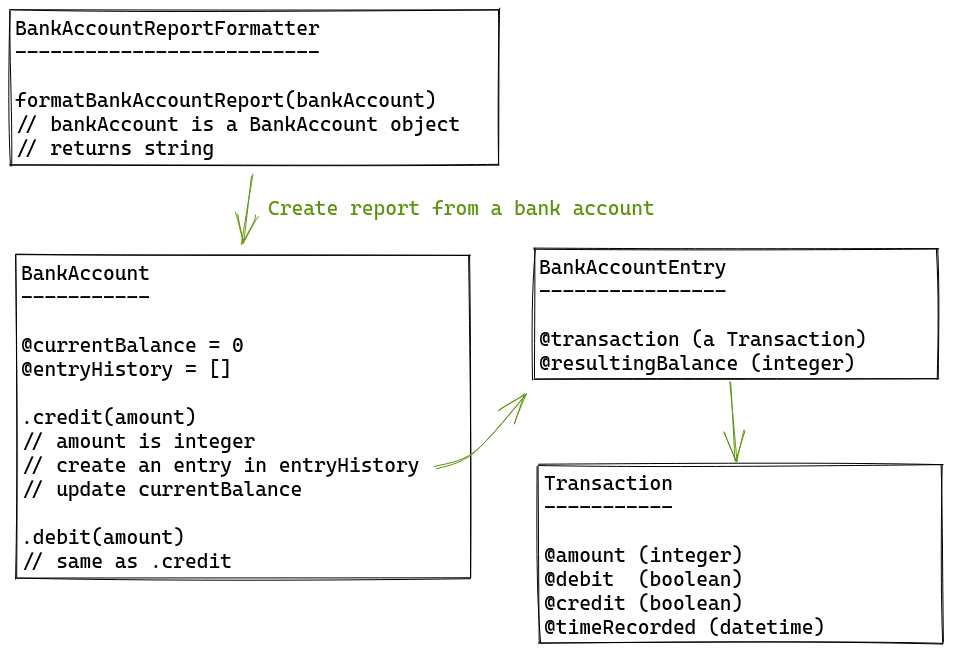
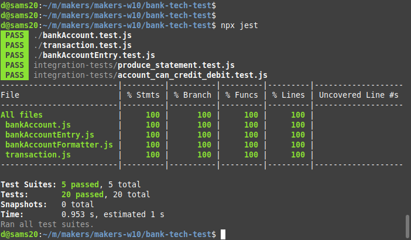

## Specification

### Requirements

- You should be able to interact with your code via a REPL like IRB or Node.
  (You don't need to implement a CLI that takes input from STDIN.)
- Deposits, withdrawal.
- Account statement (date, amount, balance) printing.
- Data can be kept in memory (it doesn't need to be stored to a database, etc).

### Acceptance criteria

**Given** a client makes a deposit of 1000 on 10-01-2023
**And** a deposit of 2000 on 13-01-2023
**And** a withdrawal of 500 on 14-01-2023
**When** she prints her bank statement
**Then** she would see

```
date || credit || debit || balance
14/01/2023 || || 500.00 || 2500.00
13/01/2023 || 2000.00 || || 3000.00
10/01/2023 || 1000.00 || || 1000.00
```

## Installation

- To run the project, you need node installed
- Download or git clone the repository
- `cd bank-tech-test`
- `npm install`
- `npx run jest` to run the tests
- There are only classes provided, no interface, as per the specs.
  Output can be read in the tests

## Design

### Initial design

Goals:

- Goals are to create uncoupled classes with appropriate levels of abstraction
- Separate view from content
- Have good naming and structre
- TDD everything
- Match the acceptance criteria output exactly

Design steps:

- The transaction is the most basic class that contains an amount. The amount
  is always positive, whether it's a withdrawal or deposit is identified with
  markers. The time of the transaction is recorded as well.
- The account needs to have a current value. A history that keeps track of the
  account balance after each transaction provides a full state of the account
  at each transaction. This provides a record of the state over time.
- A transaction has almost all data for an account entry but lacks a record of
  the current balance, so an intermediate class to hold that state is created
  (BankAccountEntry).
- A formatter that creates a bank statement string works on a class to convert
  the entry history into a formatted text string.

The design below has been slightly modified during implementation.



### TDD classes

Testing started from the smallest class, Transaction, and build from that. A
suggested better approach should be starting from the integration test and
working from there.


